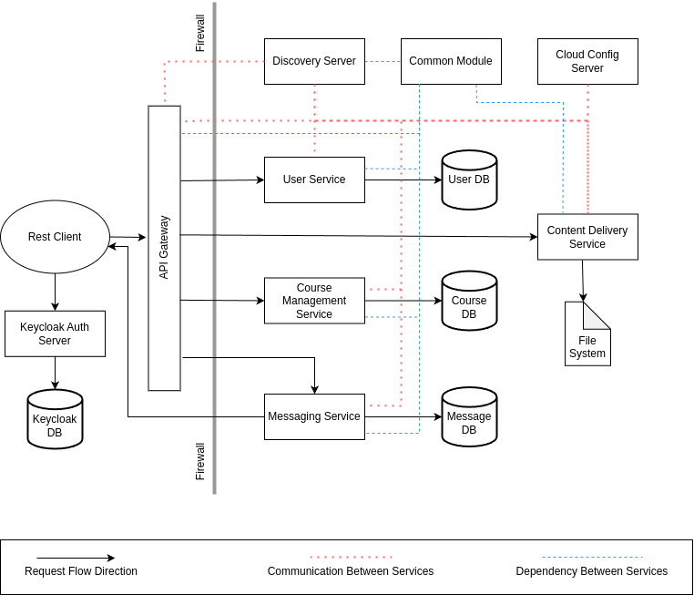

# Backend Service Diagram

# User Service

* Add regular user info
* Add admin user info
* Get single user info
* Get all regular user info
* Get all admin user info
* Update profile picture
* Update profile information

# Content Delivery Service

* Store files in the file system
* Retrieve files from file system